# Testare unitară în Python

## Descrierea aplicației

Aplicația este un utilitar Python care redenumește automat fișiere audio pe baza tagurilor stocate în acestea (titlu, artist, număr de track), după formatul `NN - Titlu.ext`.

## Clasa testată

Pentru ilustrarea strategiilor de testare am ales clasa `TrackNumberParser` din modulul `track_number_parser.py`. Aceasta este responsabilă de parsarea și manipularea numerelor de track ale fișierelor audio și conține trei metode: `parse()`, `format_track()` și `pad_track()`.

## Configurație

Proiectul a fost dezvoltat și testat pe trei sisteme diferite. Mai jos sunt prezentate configurațiile hardware și software utilizate de fiecare membru al echipei.

| Membru | OS | Procesor | RAM |
|--------|-----|----------|-----|
| Radu Daniel | Fedora 43 | AMD Ryzen 7 7730U | 16 GB |
| Roman Bianca | Ubuntu 24.04 | Intel Core i7-1255U (12th Gen) | 16 GB |
| Costache Carolina-Andreea | macOS Tahoe | Apple M4 Pro | 24 GB |

Versiunile tool-urilor utilizate sunt identice pe toate sistemele:
- Python 3.12.3
- pytest 9.0.3
- pytest-cov 7.1.0
- pytest-mock 3.15.1
- mutagen 1.47.0

## Strategii de testare

### 1. Partiționare în clase de echivalență

#### `parse()`
Metoda `parse()` primește numărul de track stocat în tagurile 
unui fișier audio și îl transformă într-un tuplu `(current, total)`.

Am împărțit setul de date de intrare în clase de echivalență.

| Clasă | Descriere | Input reprezentativ | Output așteptat |
|:---|:---|:---|:---|
| **C1** | Input nul sau gol | `None`, `""` | `(None, None)` |
| **C2** | Număr simplu valid (fără slash) | `"5"` | `(5, None)` |
| **C3** | Format cu slash valid | `"5/12"` | `(5, 12)` |
| **C4** | Slash prezent dar invalid | `"5/"` | `(None, None)` |
| **C5** | String fără cifre | `"ABC"` | `(None, None)` |
| **C6** | Litere și cifre amestecate (sanitizare) | `"Track 05"` | `(5, None)` |
| **C7** | Input non-string | `10` | `(10, None)` |

**C1 - input nul sau gol:**
```python
def test_parse_none(self):
    current, total = TrackNumberParser.parse(None)
    assert current is None
    assert total is None

def test_parse_empty_string(self):
    current, total = TrackNumberParser.parse("")
    assert current is None
    assert total is None
```

**C2 - număr simplu valid (fără slash):**
```python
def test_parse_single_number(self):
    current, total = TrackNumberParser.parse("5")
    assert current == 5
    assert total is None
```

**C3 - format cu slash valid:**
```python
def test_parse_slash_format(self):
    current, total = TrackNumberParser.parse("5/12")
    assert current == 5
    assert total == 12
```

**C4 - slash prezent dar invalid:**
```python
def test_parse_slash_missing_total(self):
    current, total = TrackNumberParser.parse("5/")
    assert current is None
    assert total is None
```

**C5 - string fără cifre:**
```python
def test_parse_no_digits(self):
    current, total = TrackNumberParser.parse("ABC")
    assert current is None
    assert total is None
```

**C6 - litere și cifre amestecate:**
```python
def test_parse_alphanumeric(self):
    current, total = TrackNumberParser.parse("Track 05")
    assert current == 5
    assert total is None
```

**C7 - input non-string:**
```python
def test_parse_integer_input(self):
    current, total = TrackNumberParser.parse(10)
    assert current == 10
    assert total is None
```

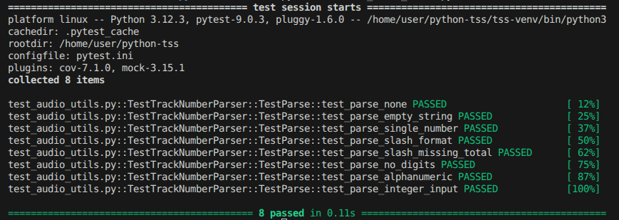

---

#### `format_track()`

Metoda primește numărul curent de track și opțional totalul, returnând un string formatat. Singura decizie din funcție este dacă `total` este furnizat sau nu.

| Clasă | Descriere | Input | Output așteptat |
|:---|:---|:---|:---|
| **C1** | Fără total | `(5)` | `"5"` |
| **C2** | Cu total furnizat | `(5, 12)` | `"5/12"` |

**C1 - fără total:**
```python
def test_format_track_without_total(self):
    result = TrackNumberParser.format_track(5)
    assert result == "5"
```

**C2 - cu total:**
```python
def test_format_track_with_total(self):
    result = TrackNumberParser.format_track(5, 12)
    assert result == "5/12"
```

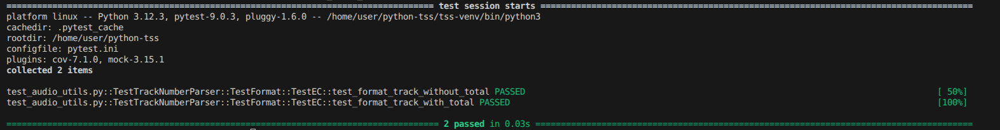

---

#### `pad_track()`

Metoda primește un număr întreg și returnează un string cu zero adăugat în față dacă numărul este mai mic de 10.

| Clasă | Descriere | Input | Output așteptat |
|:---|:---|:---|:---|
| **C1** | Număr cu o cifră (0-9) | `5` | `"05"` |
| **C2** | Număr cu două cifre (10+) | `12` | `"12"` |

**C1 - număr cu o cifră:**
```python
def test_pad_track_single_digit(self):
    result = TrackNumberParser.pad_track(5)
    assert result == "05"
```

**C2 - număr cu două cifre:**
```python
def test_pad_track_double_digit(self):
    result = TrackNumberParser.pad_track(12)
    assert result == "12"
```

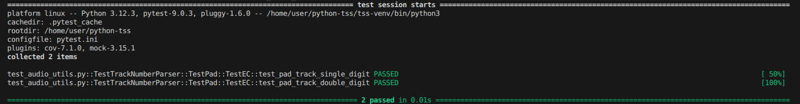

---

### 2. Analiza valorilor de frontieră

#### `parse()`


| Valoare de frontieră | Clasă | Descriere | Input | Output așteptat |
|:---|:---|:---|:---|:---|
| **BVA1** | C2 | Cel mai mic număr simplu valid | `"0"` | `(0, None)` |
| **BVA2** | C3 | Cel mai mic track cu total | `"0/1"` | `(0, 1)` |
| **BVA3** | C3 | Track egal cu total | `"12/12"` | `(12, 12)` |
| **BVA4** | C3 | Track mai mare decât total | `"15/10"` | `(15, 10)` |
| **BVA5** | C4 | Doar separator, fără cifre | `"/"` | `(None, None)` |


**BVA1 - zero fără total (marginea de jos a C2):**
```python
def test_parse_zero_without_total(self):
    current, total = TrackNumberParser.parse("0")
    assert current == 0
    assert total is None
```

**BVA2 - zero cu total (marginea de jos a C3):**
```python
def test_parse_zero_with_total(self):
    current, total = TrackNumberParser.parse("0/1")
    assert current == 0
    assert total == 1
```

**BVA3 - track egal cu total:**
```python
def test_parse_track_equals_total(self):
    current, total = TrackNumberParser.parse("12/12")
    assert current == 12
    assert total == 12
```

**BVA4 - track mai mare decât total:**
```python
def test_parse_track_exceeds_total(self):
    current, total = TrackNumberParser.parse("15/10")
    assert current == 15
    assert total == 10
```

**BVA5 - doar separator (marginea C4):**
```python
def test_parse_only_separator(self):
    current, total = TrackNumberParser.parse("/")
    assert current is None
    assert total is None
```

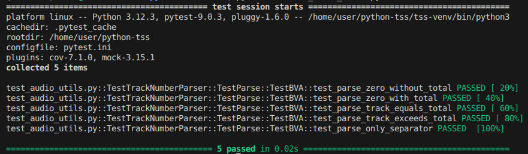

---

#### `format_track()`

Funcția nu conține logică numerică internă, doar construiește un string. Singurele frontiere relevante sunt valorile minime posibile pentru fiecare clasă.

| Valoare de frontieră | Clasă | Descriere | Input | Output așteptat |
|:---|:---|:---|:---|:---|
| **BVA1** | C1 | Cel mai mic current fără total | `(0)` | `"0"` |
| **BVA2** | C2 | Cel mai mic current și total | `(0, 0)` | `"0/0"` |

**BVA1 - zero fără total:**
```python
def test_format_track_zero_without_total(self):
    result = TrackNumberParser.format_track(0)
    assert result == "0"
```

**BVA2 - zero cu zero total:**
```python
def test_format_track_zero_with_zero_total(self):
    result = TrackNumberParser.format_track(0, 0)
    assert result == "0/0"
```

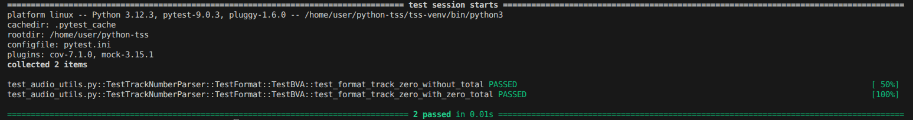

---

#### `pad_track()`

Frontiera dintre cele două clase se află între 9 și 10.

| Valoare de frontieră | Clasă | Descriere | Input | Output așteptat |
|:---|:---|:---|:---|:---|
| **BVA1** | C1 | Marginea de jos a C1 | `0` | `"00"` |
| **BVA2** | C1 | Ultimul număr cu o cifră | `9` | `"09"` |
| **BVA3** | C2 | Primul număr cu două cifre | `10` | `"10"` |

**BVA1 - zero (marginea de jos a C1):**
```python
def test_pad_track_zero(self):
    result = TrackNumberParser.pad_track(0)
    assert result == "00"
```

**BVA2 - 9 (ultimul număr cu o cifră):**
```python
def test_pad_track_nine(self):
    result = TrackNumberParser.pad_track(9)
    assert result == "09"
```

**BVA3 - 10 (primul număr cu două cifre):**
```python
def test_pad_track_ten(self):
    result = TrackNumberParser.pad_track(10)
    assert result == "10"
```

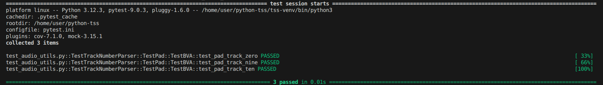

---

### 3. Acoperire la nivel de instrucțiune (Statement Coverage)

Acoperirea la nivel de instrucțiune verifică că fiecare instrucțiune (nod din CFG) este executată cel puțin o dată.

#### Nodurile identificate

**`parse()`:**

| Nod | Instrucțiune | Test care îl acoperă |
|:---|:---|:---|
| N1 | `if not track_num` | `test_parse_none` |
| N2 | `return None, None` | `test_parse_none` |
| N3 | `track_str = str(track_num).strip()` | `test_parse_single_number` |
| N4 | `if "/" in track_str` | `test_parse_single_number` |
| N5 | `split("/")` + `return current, total` | `test_parse_slash_format` |
| N6 | `return None, None` (except slash) | `test_parse_slash_missing_total` |
| N7 | `int(cifre)` + `return current, None` | `test_parse_single_number` |
| N8 | `return None, None` (except simplu) | `test_parse_no_digits` |

**`format_track()`:**

| Nod | Instrucțiune | Test care îl acoperă |
|:---|:---|:---|
| N1 | `if total is not None` | `test_format_track_without_total` |
| N2 | `return f"{current}/{total}"` | `test_format_track_with_total` |
| N3 | `return str(current)` | `test_format_track_without_total` |

**`pad_track()`:**

| Nod | Instrucțiune | Test care îl acoperă |
|:---|:---|:---|
| N1 | `return f"{track_num:02d}"` | `test_pad_track_single_digit` |

#### Grafurile de flux de control (CFG)

*CFG pentru `parse()`*
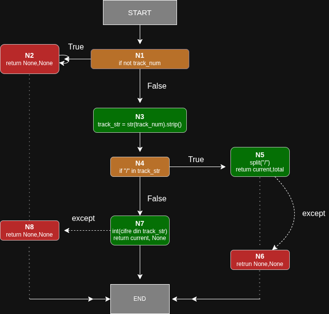

*CFG pentru `format_track()`*
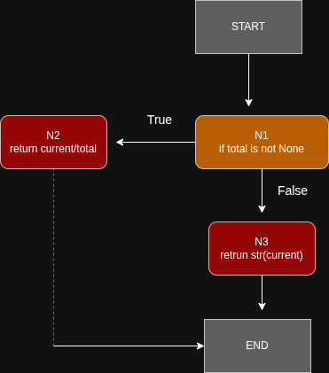


*CFG pentru `pad_track()`*
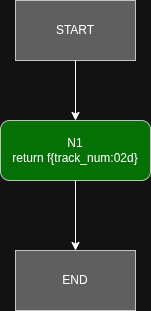


**Rezultate rulare:**

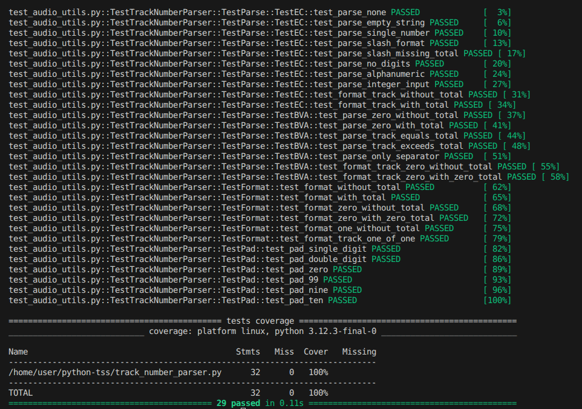

Fișierul `track_number_parser.py` conține 32 de instrucțiuni, toate acoperite de testele EC și BVA. Acoperirea la nivel de instrucțiune este de 100% pentru clasa `TrackNumberParser`.
### 4. Acoperire la nivel de decizie (Decision Coverage)

Acoperirea la nivel de decizie verifică că fiecare ramură a unei decizii (True și False) este parcursă cel puțin o dată.

#### Deciziile identificate

**`parse()`:**

| Decizie | Ramura True | Test care o acoperă | Ramura False | Test care o acoperă |
|:---|:---|:---|:---|:---|
| `if not track_num` | return None, None | `test_parse_none` | continuă execuția | `test_parse_single_number` |
| `if "/" in track_str` | parsează cu slash | `test_parse_slash_format` | parsează fără slash | `test_parse_single_number` |
| `try/except` bloc slash | return current, total | `test_parse_slash_format` | return None, None | `test_parse_slash_missing_total` |
| `try/except` bloc simplu | return current, None | `test_parse_single_number` | return None, None | `test_parse_no_digits` |

**`format_track()`:**

| Decizie | Ramura True | Test care o acoperă | Ramura False | Test care o acoperă |
|:---|:---|:---|:---|:---|
| `if total is not None` | return current/total | `test_format_track_with_total` | return str(current) | `test_format_track_without_total` |

**`pad_track()`:** nu conține decizii, are un singur bloc de execuție.

#### Rezultate rulare

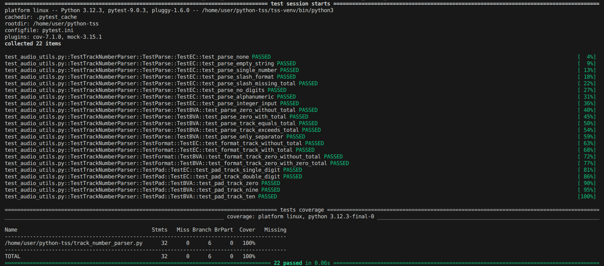

Toate cele 6 ramuri identificate sunt acoperite, rezultând o acoperire de 100% la nivel de decizie.

### 5. Acoperire la nivel de condiție (Condition Coverage)

Acoperirea la nivel de condiție verifică că fiecare condiție atomică dintr-o decizie ia atât valoarea True cât și valoarea False.

#### Condițiile identificate

**`parse()`:**

| Condiție atomică | Valoare True | Test | Valoare False | Test |
|:---|:---|:---|:---|:---|
| `not track_num` | `None` | `test_parse_none` | `"5"` | `test_parse_single_number` |
| `"/" in track_str` | `"5/12"` | `test_parse_slash_format` | `"5"` | `test_parse_single_number` |
| `c.isdigit()` (parts[0]) | `"5/12"` | `test_parse_slash_format` | `"5/"` | `test_parse_slash_missing_total` |
| `c.isdigit()` (parts[1]) | `"5/12"` | `test_parse_slash_format` | `"abc/def"` | `test_parse_no_digits` |
| `c.isdigit()` (bloc simplu) | `"5"` | `test_parse_single_number` | `"ABC"` | `test_parse_no_digits` |

**`format_track()`:**

| Condiție atomică | Valoare True | Test | Valoare False | Test |
|:---|:---|:---|:---|:---|
| `total is not None` | `(5, 12)` | `test_format_track_with_total` | `(5)` | `test_format_track_without_total` |

**`pad_track()`:** nu conține condiții atomice, are un singur bloc de execuție.


Toate condițiile atomice identificate iau atât valoarea True cât și valoarea False în cadrul testelor EC existente. Nu au fost necesare teste suplimentare pentru a atinge acoperirea la nivel de condiție.