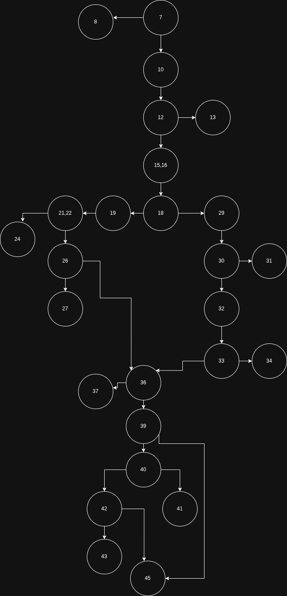
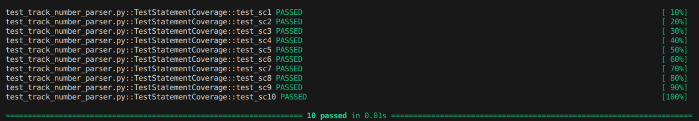
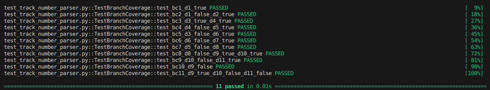
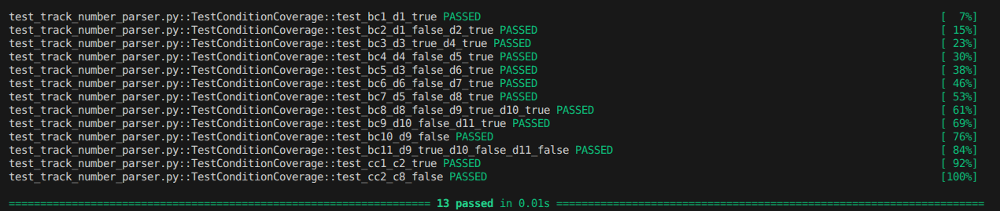
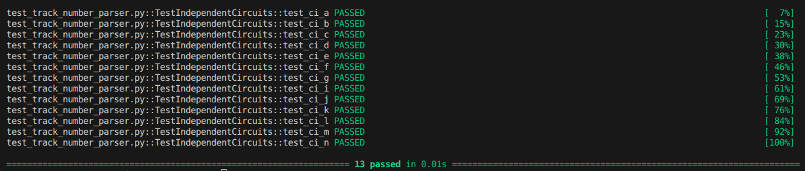

# Testare unitară în Python

## Descrierea aplicației

Aplicația este un utilitar Python care redenumește automat fișiere audio pe baza tagurilor stocate în acestea (titlu, artist, număr de track), după formatul `NN - Titlu.ext`.

## Clasa testată

Pentru ilustrarea strategiilor de testare am ales clasa `TrackNumberParser` din modulul `track_number_parser.py`. Aceasta este responsabilă de parsarea, validarea și normalizarea numerelor de track ale fișierelor audio și conține o singură metodă statică: `validate_and_normalize()`.
## Configurație

Proiectul a fost dezvoltat și testat pe trei sisteme diferite. Mai jos sunt prezentate configurațiile hardware și software utilizate de fiecare membru al echipei.

| Membru | OS | Procesor | RAM |
|--------|-----|----------|-----|
| Radu Daniel | Fedora 43 | AMD Ryzen 7 7730U | 16 GB |
| Roman Bianca | Ubuntu 24.04 | Intel Core i7-1255U (12th Gen) | 16 GB |
| Costache Carolina-Andreea | macOS Tahoe | Apple M4 Pro | 24 GB |

Versiunile tool-urilor utilizate sunt identice pe toate sistemele:
- Python 3.12.3
- pytest 9.0.3
- pytest-cov 7.1.0
- pytest-mock 3.15.1
- mutagen 1.47.0

## Strategii de testare

# 1.Clase de echivalență

## Specificații

Funcția primește un string `track_num` care reprezintă numărul unui track (`"3"` sau `"3/10"`) și un întreg opțional `max_tracks` care reprezintă limita maximă a albumului. Returnează un tuplu `(current, total, error)`. Dacă inputul e valid, `error` este `None`; dacă e invalid, `current` și `total` sunt `None` și `error` conține mesajul erorii.

`track_num` poate fi `None`, un string gol, un număr simplu sau un număr în formatul `current/total`. Dacă conține litere si cifre, literele sunt eliminate. Cifrele nu pot fi zero. Dacă există `total`, `current` nu poate depăși `total`. Dacă este furnizat `max_tracks`, nici `total` nici `current` nu pot depăși această limită.

---

## Tabel clase de echivalență
 
| ID | Regulă | `track_num` | `max_tracks` | Output așteptat |
|----|--------|-------------|--------------|-----------------|
| C1 | Input absent | `None` | `None` | `(None, None, "empty input")` |
| C2 | Input gol | `""` | `None` | `(None, None, "empty input")` |
| C3 | Input doar spații | `"   "` | `None` | `(None, None, "empty input")` |
| C4 | Fara cifră în string | `"abc"` | `None` | `(None, None, "parse error")` |
| C5 | Current este zero | `"0"` | `None` | `(None, None, "zero not allowed")` |
| C6 | Current este zero (format cu slash) | `"0/10"` | `None` | `(None, None, "zero not allowed")` |
| C7 | Total este zero | `"3/0"` | `None` | `(None, None, "zero not allowed")` |
| C8 | Current depășește total | `"7/3"` | `None` | `(None, None, "current exceeds total")` |
| C9 | Total depășește max_tracks | `"3/15"` | `10` | `(None, None, "total exceeds max")` |
| C10 | Current depășește max_tracks | `"8"` | `5` | `(None, None, "current exceeds max")` |
| C11 | Format simplu valid | `"5"` | `None` | `(5, None, None)` |
| C12 | Format slash valid | `"3/10"` | `None` | `(3, 10, None)` |
| C13 | Litere și cifre amestecate | `"track3"` | `None` | `(3, None, None)` |
| C14 | Valid cu max_tracks respectat (cu total) | `"3/10"` | `10` | `(3, 10, None)` |
| C15 | Valid cu max_tracks respectat (fără total) | `"5"` | `10` | `(5, None, None)` |
 

 

 # Clase de frontieră

Testarea la frontieră verifică valorile exact pe limita dintre două clase de echivalență, imediat sub și imediat peste.

## Tabel clase de frontieră

| ID | Regulă | `track_num` | `max_tracks` | Output așteptat |
|----|--------|-------------|--------------|-----------------|
| F1 | Current sub limita minimă (zero) | `"0"` | `None` | `(None, None, "zero not allowed")` |
| F2 | Current exact pe limita minimă | `"1"` | `None` | `(1, None, None)` |
| F3 | Current peste limita minimă | `"2"` | `None` | `(2, None, None)` |
| F4 | Total sub limita minimă (zero) | `"3/0"` | `None` | `(None, None, "zero not allowed")` |
| F5 | Total exact pe limita minimă | `"1/1"` | `None` | `(1, 1, None)` |
| F6 | Total peste limita minimă | `"1/2"` | `None` | `(1, 2, None)` |
| F7 | Current sub total cu o unitate | `"4/5"` | `None` | `(4, 5, None)` |
| F8 | Current egal cu total | `"5/5"` | `None` | `(5, 5, None)` |
| F9 | Current depășește total cu o unitate | `"6/5"` | `None` | `(None, None, "current exceeds total")` |
| F10 | Total sub max_tracks cu o unitate | `"3/9"` | `10` | `(3, 9, None)` |
| F11 | Total egal cu max_tracks| `"3/10"` | `10` | `(3, 10, None)` |
| F12 | Total depășește max_tracks cu o unitate | `"3/11"` | `10` | `(None, None, "total exceeds max")` |
| F13 | Current sub max_tracks cu o unitate (fără total) | `"9"` | `10` | `(9, None, None)` |
| F14 | Current egal cu max_tracks | `"10"` | `10` | `(10, None, None)` |
| F15 | Current depășește max_tracks cu o unitate| `"11"` | `10` | `(None, None, "current exceeds max")` |

# Testare structurală 
 
## Control Flow Graph (CFG)

 

## Acoperire la nivel de instrucțiune (Statement Coverage)
 
Fiecare nod din CFG trebuie parcurs cel puțin o dată.
 
| Test | `track_num` | `max_tracks` | Nod parcurs | Output așteptat |
|------|-------------|--------------|-----------------|-----------------|
| SC1 | `None` | `None` | 7, 8 | `(None, None, "empty input")` |
| SC2 | `"   "` | `None` | 7, 10, 12, 13 | `(None, None, "empty input")` |
| SC3 | `"//"` | `None` | 7, 10, 12, 15-16, 18, 19, 21-22, 24 | `(None, None, "parse error")` |
| SC4 | `"0/10"` | `None` | 7, 10, 12, 15-16, 18, 19, 21-22, 26, 27 | `(None, None, "zero not allowed")` |
| SC5 | `"abc"` | `None` | 7, 10, 12, 15-16, 18, 29, 30, 31 | `(None, None, "parse error")` |
| SC6 | `"0"` | `None` | 7, 10, 12, 15-16, 18, 29, 30, 32, 33, 34 | `(None, None, "zero not allowed")` |
| SC7 | `"7/3"` | `None` | 7, 10, 12, 15-16, 18, 19, 21-22, 26, 36, 37 | `(None, None, "current exceeds total")` |
| SC8 | `"3/15"` | `10` | 7, 10, 12, 15-16, 18, 19, 21-22, 26, 36, 39, 40, 41 | `(None, None, "total exceeds max")` |
| SC9 | `"8"` | `5` | 7, 10, 12, 15-16, 18, 29, 30, 32, 33, 36, 39, 40, 42, 43 | `(None, None, "current exceeds max")` |
| SC10 | `"3/10"` | `None` | 7, 10, 12, 15-16, 18, 19, 21-22, 26, 36, 39, 45 | `(3, 10, None)` |

## Acoperire la nivel de ramură (Branch Coverage) 
 

### Deciziile din cod
 
| ID | Decizie |
|----|---------|
| D1 | `not track_num` |
| D2 | `not track_str` |
| D3 | `"/" in track_str` |
| D4 | `except (ValueError, IndexError)` |
| D5 | `cur==0 or tot==0` |
| D6 | `not digits` |
| D7 | `cur==0` |
| D8 | `tot is not None and cur > tot` |
| D9 | `max_tracks is not None` |
| D10 | `tot is not None and tot > max_tracks` |
| D11 | `tot is None and cur > max_tracks` |
 ### Acoperire True/False pentru fiecare decizie

| Decizie | Test True | `track_num` | `max_tracks` | Output așteptat | Test False | `track_num` | `max_tracks` | Output așteptat |
|---------|-----------|-------------|--------------|-----------------|------------|-------------|--------------|-----------------|
| D1 | BC1 | `None` | `None` | `(None, None, "empty input")` | BC2 | `"   "` | `None` | `(None, None, "empty input")` |
| D2 | BC2 | `"   "` | `None` | `(None, None, "empty input")` | BC3 | `"//"` | `None` | `(None, None, "parse error")` |
| D3 | BC3 | `"//"` | `None` | `(None, None, "parse error")` | BC5 | `"abc"` | `None` | `(None, None, "parse error")` |
| D4 | BC3 | `"//"` | `None` | `(None, None, "parse error")` | BC4 | `"0/10"` | `None` | `(None, None, "zero not allowed")` |
| D5 | BC4 | `"0/10"` | `None` | `(None, None, "zero not allowed")` | BC7 | `"7/3"` | `None` | `(None, None, "current exceeds total")` |
| D6 | BC5 | `"abc"` | `None` | `(None, None, "parse error")` | BC6 | `"0"` | `None` | `(None, None, "zero not allowed")` |
| D7 | BC6 | `"0"` | `None` | `(None, None, "zero not allowed")` | BC9 | `"8"` | `5` | `(None, None, "current exceeds max")` |
| D8 | BC7 | `"7/3"` | `None` | `(None, None, "current exceeds total")` | BC8 | `"3/15"` | `10` | `(None, None, "total exceeds max")` |
| D9 | BC8 | `"3/15"` | `10` | `(None, None, "total exceeds max")` | BC10 | `"3/10"` | `None` | `(3, 10, None)` |
| D10 | BC8 | `"3/15"` | `10` | `(None, None, "total exceeds max")` | BC11 | `"3/10"` | `10` | `(3, 10, None)` |
| D11 | BC9 | `"8"` | `5` | `(None, None, "current exceeds max")` | BC11 | `"3/10"` | `10` | `(3, 10, None)` |

## Acoperire la nivel de condiție (Condition Coverage)
 
Fiecare condiție individuală dintr-o decizie compusă trebuie să ia atât valoarea True cât și valoarea False.
 
### Condițiile individuale din deciziile compuse
 
| ID | Decizie | Condiție individuală |
|----|---------|----------------------|
| C1 | D5: `cur==0 or tot==0` | `cur==0` |
| C2 | D5: `cur==0 or tot==0` | `tot==0` |
| C3 | D8: `tot is not None and cur > tot` | `tot is not None` |
| C4 | D8: `tot is not None and cur > tot` | `cur > tot` |
| C5 | D10: `tot is not None and tot > max` | `tot is not None` |
| C6 | D10: `tot is not None and tot > max` | `tot > max` |
| C7 | D11: `tot is None and cur > max` | `tot is None` |
| C8 | D11: `tot is None and cur > max` | `cur > max` |
 
### Acoperire True/False pentru fiecare condiție individuală
 
| Condiție | Test True | `track_num` | `max_tracks` | Output așteptat | Test False | `track_num` | `max_tracks` | Output așteptat |
|----------|-----------|-------------|--------------|-----------------|------------|-------------|--------------|-----------------|
| C1: `cur==0` | BC4 | `"0/10"` | `None` | `(None, None, "zero not allowed")` | BC7 | `"7/3"` | `None` | `(None, None, "current exceeds total")` |
| C2: `tot==0` | CC1 | `"3/0"` | `None` | `(None, None, "zero not allowed")` | BC4 | `"0/10"` | `None` | `(None, None, "zero not allowed")` |
| C3: `tot is not None` | BC7 | `"7/3"` | `None` | `(None, None, "current exceeds total")` | BC9 | `"8"` | `5` | `(None, None, "current exceeds max")` |
| C4: `cur > tot` | BC7 | `"7/3"` | `None` | `(None, None, "current exceeds total")` | BC8 | `"3/15"` | `10` | `(None, None, "total exceeds max")` |
| C5: `tot is not None` | BC8 | `"3/15"` | `10` | `(None, None, "total exceeds max")` | BC9 | `"8"` | `5` | `(None, None, "current exceeds max")` |
| C6: `tot > max` | BC8 | `"3/15"` | `10` | `(None, None, "total exceeds max")` | BC11 | `"3/10"` | `10` | `(3, 10, None)` |
| C7: `tot is None` | BC9 | `"8"` | `5` | `(None, None, "current exceeds max")` | BC8 | `"3/15"` | `10` | `(None, None, "total exceeds max")` |
| C8: `cur > max` | BC9 | `"8"` | `5` | `(None, None, "current exceeds max")` | CC2 | `"3"` | `10` | `(3, None, None)` |
 

 

 ## Testarea circuitelor independente
 
Adăugând câte un arc de la fiecare nod terminal (8, 13, 24, 27, 31, 34, 37, 41, 43, 45) la nodul de start (7), obținem un graf complet conectat cu:
 
- n = 26 noduri
- e = 38 arce
- p = 1 
$$V(G) = e - n + 2p = 38 - 26 + 2 = 14$$
 
Circuite independente:
 
a) 7, 8, 7
 
b) 7, 10, 12, 13, 7
 
c) 7, 10, 12, 15-16, 18, 19, 21-22, 24, 7
 
d) 7, 10, 12, 15-16, 18, 19, 21-22, 26, 27, 7
 
e) 7, 10, 12, 15-16, 18, 29, 30, 31, 7
 
f) 7, 10, 12, 15-16, 18, 29, 30, 32, 33, 34, 7
 
g) 7, 10, 12, 15-16, 18, 19, 21-22, 26, 36, 37, 7
 
h) 7, 10, 12, 15-16, 18, 29, 30, 32, 33, 36, 37, 7
 
i) 7, 10, 12, 15-16, 18, 19, 21-22, 26, 36, 39, 45, 7
 
j) 7, 10, 12, 15-16, 18, 29, 30, 32, 33, 36, 39, 45, 7
 
k) 7, 10, 12, 15-16, 18, 19, 21-22, 26, 36, 39, 40, 41, 7
 
l) 7, 10, 12, 15-16, 18, 29, 30, 32, 33, 36, 39, 40, 42, 43, 7
 
m) 7, 10, 12, 15-16, 18, 19, 21-22, 26, 36, 39, 40, 42, 45, 7
 
n) 7, 10, 12, 15-16, 18, 29, 30, 32, 33, 36, 39, 40, 42, 45, 7

| Circuit | `track_num` | `max_tracks` | Output așteptat | Acoperit de |
|---------|-------------|--------------|-----------------|-------------|
| a) 7, 8 | `None` | `None` | `(None, None, "empty input")` | BC1 |
| b) 7, 10, 12, 13 | `"   "` | `None` | `(None, None, "empty input")` | BC2 |
| c) 7, 10, 12, 15-16, 18, 19, 21-22, 24 | `"//"` | `None` | `(None, None, "parse error")` | BC3 |
| d) 7, 10, 12, 15-16, 18, 19, 21-22, 26, 27 | `"0/10"` | `None` | `(None, None, "zero not allowed")` | BC4 |
| e) 7, 10, 12, 15-16, 18, 29, 30, 31 | `"abc"` | `None` | `(None, None, "parse error")` | BC5 |
| f) 7, 10, 12, 15-16, 18, 29, 30, 32, 33, 34 | `"0"` | `None` | `(None, None, "zero not allowed")` | BC6 |
| g) 7, 10, 12, 15-16, 18, 19, 21-22, 26, 36, 37 | `"7/3"` | `None` | `(None, None, "current exceeds total")` | BC7 |
| h) 7, 10, 12, 15-16, 18, 29, 30, 32, 33, 36, 37 | — | — | — | nefezabil |
| i) 7, 10, 12, 15-16, 18, 19, 21-22, 26, 36, 39, 45 | `"3/10"` | `None` | `(3, 10, None)` | BC10 |
| j) 7, 10, 12, 15-16, 18, 29, 30, 32, 33, 36, 39, 45 | `"5"` | `None` | `(5, None, None)` | CI |
| k) 7, 10, 12, 15-16, 18, 19, 21-22, 26, 36, 39, 40, 41 | `"3/15"` | `10` | `(None, None, "total exceeds max")` | BC8 |
| l) 7, 10, 12, 15-16, 18, 29, 30, 32, 33, 36, 39, 40, 42, 43 | `"8"` | `5` | `(None, None, "current exceeds max")` | BC9 |
| m) 7, 10, 12, 15-16, 18, 19, 21-22, 26, 36, 39, 40, 42, 45 | `"3/10"` | `10` | `(3, 10, None)` | BC11 |
| n) 7, 10, 12, 15-16, 18, 29, 30, 32, 33, 36, 39, 40, 42, 45 | `"3"` | `10` | `(3, None, None)` | CC2 |

